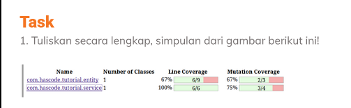

# Praktikum Software Testing Fundamental
## Soal nomor 1

> Pada gambar tersebut menjelaskan tentang hasil dari sebuah coverage test yang menguji class entity dan service pada sebuah program. Hasil dari test class entity menghasilkan 67% line coverage dan 67% mutation coverage, selanjutnya hasil dari test class service 100% line coverage dan 75% mutation coverage.

## Soal nomor 2

> Pada gambar tersebut menapilkan line code dengan highlight hijau dan merah, hijau menandakan line code/class tersebut telah pass dalam unit test. Untuk yang highlight merah menandakan tidak pass unit test dikarenakan pada class tersebut menggunakan 'return c' yang telah digunakan di class sebelumnya.